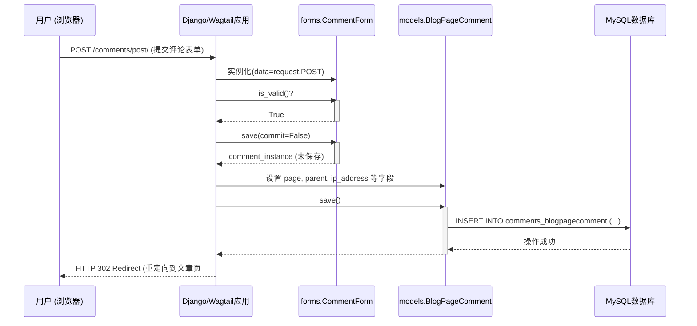

# **博客系统 - 详细设计说明书 (DDD)**

**版本: 1.0**

**日期: 2025-06-13**

---

## **1. 引言 (Introduction)**

### **1.1 目的 (Purpose)**
本文档旨在为“Wagtail博客系统”的开发人员提供详细的技术实现指导。它在《概要设计说明书》的基础上，对系统中的核心模块、类和函数进行了深入的设计和阐述，明确了内部实现逻辑、接口契约和关键算法。

### **1.2 范围 (Scope)**
本文档的范围涵盖了所有核心业务模块的内部设计，主要包括：
* 博客内容管理 (`apps.blog`)
* 评论系统 (`apps.comments`)
* 搜索功能 (`apps.search`)
* 基础功能和异步任务 (`apps.base`)

---

## **2. 模块详细设计: `apps.blog` (博客核心)**

### **2.1 模块概述**
`blog` 应用是整个系统的核心，负责文章内容的创建、展示和相关互动（如点赞、浏览计数）的逻辑。

### **2.2 类与方法设计**

#### **2.2.1 `models.BlogPage`**
* **文件**: `apps/blog/models.py`
* **描述**: 文章页面的主模型，继承自 `wagtail.models.Page`。
* **关键属性**:
    * `date`: `models.DateField` - 文章的发布日期。
    * `tags`: `TaggableManager` - 通过 `django-taggit` 实现的标签功能。
    * `body`: `StreamField` - 文章正文，是此模型的核心。其结构在 `apps/blog/blocks.py` 中定义，允许内容创作者自由组合富文本、Markdown、代码、图片等内容块。在数据库中，此字段存储为JSON格式的文本。
    * `authors`: `ParentalManyToManyField` - 指向 `Author` 模型，允许多作者。
    * `gallery_images`: `InlinePanel` - 关联 `BlogPageGalleryImage`，实现文章内嵌图库。
* **关键方法**:
    * `def get_context(self, request, *args, **kwargs)`:
        * **描述**: 重写Wagtail的此方法，为前端模板准备上下文数据。
        * **核心逻辑**:
            1.  调用 `super().get_context()` 获取基础上下文。
            2.  获取本篇文章的所有评论，并按评论树结构进行组织。
            3.  将评论列表、评论表单 (`CommentForm`) 添加到上下文中。
            4.  返回更新后的上下文 `dict`。
        * **返回值**: `dict` - 包含模板渲染所需全部数据的字典。

#### **2.2.2 `middleware.PageViewMiddleware`**
* **文件**: `apps/blog/middleware.py`
* **描述**: 一个自定义的Django中间件，用于智能地追踪和统计文章的浏览量。
* **关键方法**:
    * `def __call__(self, request)`:
        * **描述**: 中间件的核心处理逻辑。
        * **核心逻辑**:
            1.  调用 `get_response(request)` 继续处理请求链，获取到响应 `response`。
            2.  **前置条件检查**:
                * 检查 `response.status_code` 是否为200。
                * 检查请求的 `User-Agent` 是否为已知的爬虫，如果是则忽略。
                * 检查请求的页面对象 `page` 是否存在且为 `BlogPage` 的实例，并且已发布 (`live`)。
                * 检查请求是否为Wagtail的预览模式。
            3.  如果所有条件满足，则调用工具函数 `utils.update_page_view(page, request)`。
            4.  返回原始响应 `response`。

#### **2.2.3 `utils.update_page_view(page, request)`**
* **文件**: `apps/blog/utils.py` (假设存在此工具文件)
* **描述**: 实际执行页面浏览量更新的工具函数。
* **核心逻辑**:
    1.  从 `request.session` 中获取一个名为 `viewed_pages` 的列表，如果不存在则初始化为空列表。
    2.  检查当前 `page.id` 是否已存在于 `viewed_pages` 中。
    3.  **如果 `page.id` 不在列表中**:
        a.  使用 `get_or_create` 获取或创建与 `page` 关联的 `PageViewCount` 对象。
        b.  使用 `F()` 表达式对 `total_views` 字段执行原子增1操作 (`total_views=F('total_views') + 1`)，避免竞态条件。
        c.  将 `page.id` 添加到会话的 `viewed_pages` 列表中。
        d.  标记会话已修改：`request.session.modified = True`。
    4.  **如果 `page.id` 已在列表中**，则不执行任何操作（防止刷新页面重复计数）。

---

## **3. 模块详细设计: `apps.comments` (评论系统)**

### **3.1 模块概述**
`comments` 应用处理所有与文章评论相关的功能，包括评论的提交、展示和后台管理。

### **3.2 类与方法设计**

#### **3.2.1 `views.post_comment_view`**
* **文件**: `apps/comments/views.py`
* **描述**: 处理前端用户提交新评论的HTTP POST请求的功能视图。
* **核心逻辑**:
    1.  **请求方法检查**: 确认请求为 `POST`。
    2.  **表单实例化**: 使用 `request.POST` 数据实例化 `CommentForm`。
    3.  **表单验证**: 调用 `form.is_valid()`。
        * **如果无效**: 重新渲染带有错误信息的文章页面。
        * **如果有效**:
            a.  调用 `form.save(commit=False)` 创建一个 `BlogPageComment` 模型实例，但不立即写入数据库。
            b.  从 `form.cleaned_data` 获取页面 `pk` 和父评论 `parent_id`。
            c.  将页面对象 `page` 赋给评论实例的 `page` 字段。
            d.  如果存在 `parent_id`，则查询并设置 `parent` 字段。
            e.  设置评论的 `ip_address`。
            f.  调用 `comment.save()` 将评论数据持久化到MySQL。
    4.  **重定向**: 返回一个 `HttpResponseRedirect`，将用户重定向到文章页面的评论区锚点（如 `.../blog-post-slug/#comment-123`）。

### **3.3 交互流程：提交评论 (时序图)**

---

## **4. 模块详细设计: `apps.search` (搜索功能)**

### **4.1 模块概述**
`search` 应用提供了系统的核心搜索能力，它与后端的搜索引擎（MongoDB/Elasticsearch）交互，并提供API和分析功能。

### **4.2 类与方法设计**

#### **4.2.1 `core.search_posts`**
* **文件**: `apps/search/core.py`
* **描述**: 执行实际搜索操作的核心函数，封装了与搜索引擎的交互。
* **参数**: `query` (str), `page` (int)
* **核心逻辑**:
    1.  **参数清洗**: 对输入的 `query` 字符串进行必要的清理（例如去除多余空格）。
    2.  **后端选择**: (假设通过settings配置) 判断应使用哪个搜索引擎。
    3.  **MongoDB实现**:
        a.  获取MongoDB客户端 (`mongo.get_db()`)。
        b.  使用`jieba.cut_for_search()`对`query`进行分词。
        c.  构造MongoDB的查询文档，使用 `$text` 和 `$search` 操作符对`tokens`字段进行文本搜索。
        d.  可以加入 `$project` 来控制返回字段，加入 `$sort` 来按相关性分数 (`{ score: { $meta: "textScore" } }`) 和发布日期排序。
        e.  执行查询，并处理分页逻辑。
    4.  **数据格式化**: 将从搜索引擎返回的结果（通常是`page_id`列表和一些元数据）格式化为统一的 `dict`。
* **返回值**: `dict` - 包含搜索结果（`page_id`列表）、总数、当前页码等信息。

#### **4.2.2 `api.SearchAPIView`**
* **文件**: `apps/search/api.py`
* **描述**: 一个基于DRF的API视图，通过RESTful接口暴露搜索功能。
* **关键方法**:
    * `def get(self, request, *args, **kwargs)`:
        * **描述**: 处理 `GET` 请求。
        * **核心逻辑**:
            1.  从请求查询参数中获取 `q` (查询词) 和 `page` (页码)。
            2.  如果 `q` 不存在或为空，返回空的成功响应或错误信息。
            3.  调用 `core.search_posts(query=q, page=page)` 执行搜索。
            4.  根据 `search_posts` 返回的`page_id`列表，从MySQL中批量查询出完整的`BlogPage`对象。
            5.  使用DRF的序列化器 (`BlogPageSerializer`) 将`BlogPage`对象列表序列化为JSON格式。
            6.  构建包含分页信息的最终响应JSON。
        * **返回值**: `rest_framework.response.Response` - 包含搜索结果和分页数据的JSON响应。
---

## **5. 模块详细设计: `apps.base` (基础功能)**

### **5.1 模块概述**
`base` 应用提供跨应用共享的功能，如通用的页面模型、异步任务和工具函数。

### **5.2 类与方法设计**

#### **5.2.1 `tasks.send_email_task`**
* **文件**: `apps/base/tasks.py`
* **描述**: 一个Celery共享任务 (`@shared_task`)，用于异步发送电子邮件。
* **参数**: `subject` (str), `body` (str), `from_email` (str), `to_emails` (list), `reply_to` (list)
* **核心逻辑**:
    1.  **任务日志**: 记录任务开始执行的日志。
    2.  **调用Django邮件后端**: 直接调用Django内置的 `send_mail` 函数，并传入所有参数。
    3.  `send_mail` 会处理与在 `settings.py` 中配置的SMTP服务器的实际通信。
    4.  **异常处理**: 使用 `try...except` 块捕获可能发生的SMTP异常（如连接错误、认证失败），并记录详细的错误日志。
    5.  **任务重试**: (可选，但推荐) 在 `@shared_task` 装饰器中可以配置自动重试策略（`autoretry_for`, `retry_kwargs`），例如在网络问题时自动重试。
* **返回值**: `None`
