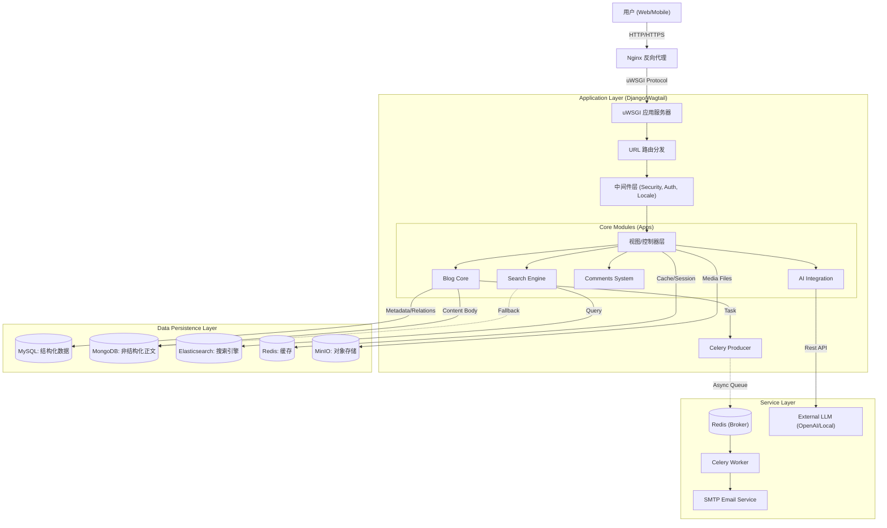
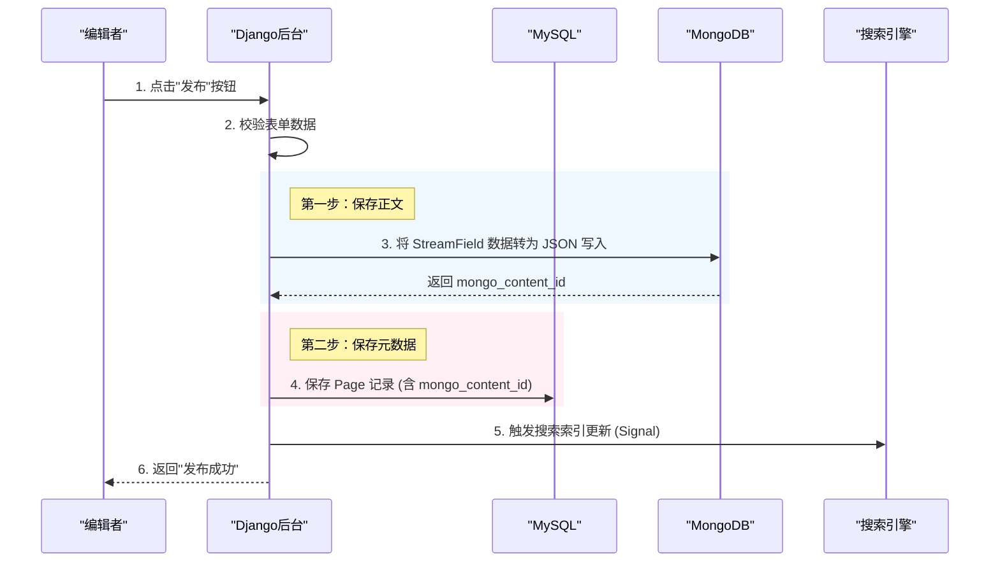

**博客系统 - 软件概要设计说明书 (HLD)**

**版本: 2.0**
**日期: 2025-06-14**
**修订人: System Architect**

---

## **1. 引言 (Introduction)**

### **1.1 编写目的**
本概要设计说明书旨在宏观层面定义 "Wagtail博客系统" (WagtailBlog3) 的系统架构、模块划分、数据存储策略及关键业务流程。它将需求规格说明书 (SRS) 中的业务需求转化为技术实现方案，指导后续的详细设计与开发工作。

### **1.2 适用范围**
本文档适用于 WagtailBlog3 的后端架构、数据库设计、API 接口设计以及部署架构。

### **1.3 参考资料**
* 《01-软件需求规格说明书》
* Wagtail CMS 官方文档
* Django 5.x 官方文档
* 项目源代码 (`wagtailblog3/` 目录)

---

## **2. 系统总体架构 (System Architecture)**

### **2.1 架构设计原则**
系统采用 **分层架构 (Layered Architecture)** 与 **模块化 (Modular)** 设计，核心遵循 Django 的 MTV (Model-Template-View) 模式，但在数据持久层引入了 **混合存储 (Polyglot Persistence)** 策略以适应复杂的富文本内容存储需求。

### **2.2 技术架构图**
系统由 Web 层、应用层、服务层和数据层组成。

### **2.3 技术栈清单**

  * **Web 框架**: Django 5.2 + Wagtail 7.2
  * **语言**: Python 3.13
  * **数据库**:
      * **MySQL**: 存储用户、页面层级、评论、标签等强关系数据。
      * **MongoDB**: 存储博客文章正文 (StreamField JSON)、操作日志及部分搜索索引。
  * **缓存与队列**: Redis (缓存 + Celery Broker)
  * **搜索**: Elasticsearch (主) / MongoDB Atlas Search (备)
  * **对象存储**: MinIO (兼容 AWS S3)
  * **AI 后端**: 集成 OpenAI 兼容接口，用于内容辅助生成。
  * **前端**: Gretzia 主题 (HTML5/jQuery), Mermaid.js (图表), KaTeX (公式)。

-----

## **3. 模块划分与设计 (Module Decomposition)**

系统后端代码严格遵循 Django App 隔离原则，位于 `apps/` 目录下。

### **3.1 核心业务模块**

#### **3.1.1 博客核心 (`apps.blog`)**

  * **职责**: 管理文章、作者、分类及图文内容。
  * **关键特性**:
      * **混合存储模型**: `BlogPage` 模型重写了 `save()` 和 `delete()` 方法，实现了元数据存 MySQL，正文内容 (StreamField) 存 MongoDB 的双写逻辑。
      * **智能编辑**: 集成 `wagtail_ai`，提供 `AITitleFieldPanel` (标题生成) 和 `AIDescriptionFieldPanel` (摘要生成)。
      * **图表支持**: 自定义 `MermaidBlock`，支持流程图代码化。
      * **统计**: 内置 `PageView` 和 `Reaction` (点赞/心情) 功能。

#### **3.1.2 评论系统 (`apps.comments`)**

  * **职责**: 独立于 Wagtail 内置评论的自定义评论系统。
  * **关键特性**:
      * 支持无限级（或限制级）回复树。
      * 记录评论者 IP、User-Agent。
      * 包含独立的后台审核仪表盘 (`dashboard.html`)。

#### **3.1.3 搜索服务 (`apps.search`)**

  * **职责**: 提供统一的站内搜索接口。
  * **关键特性**:
      * **后端抽象**: 封装了搜索逻辑，可配置使用 Elasticsearch 或 MongoDB 的文本搜索功能。
      * **分析**: 记录用户搜索词 (`SearchTerm`)，提供后台热词分析报表。

#### **3.1.4 作品集 (`apps.portfolio`)**

  * **职责**: 展示个人或团队的项目案例。
  * **关键特性**: 独立的 `PortfolioPage` 类型，采用卡片式布局，与博客文章分离。

#### **3.1.5 归档系统 (`apps.archive`)**

  * **职责**: 提供基于时间的文章索引。
  * **关键特性**: 自动按 `年/月` 生成归档视图，无需手动维护。

### **3.2 基础支撑模块**

#### **3.2.1 基础组件 (`apps.base`)**

  * **职责**: 提供全站通用的工具、基类和任务。
  * **关键特性**:
      * **异步任务**: 定义 Celery 任务 (`tasks.py`)，如发送邮件。
      * **表单页**: 扩展 `FormPage`，支持邮件通知回调。

#### **3.2.2 首页 (`apps.home`)**

  * **职责**: 管理网站首页的布局和推广内容。
  * **关键特性**: 可配置 Hero Banner、CTA 按钮及最新文章聚合。

-----

## **4. 数据存储设计 (Data Storage Strategy)**

本系统采用 **混合持久化 (Polyglot Persistence)** 架构，以解决传统关系型数据库在处理大型 JSON 富文本时的性能瓶颈。

### **4.1 MySQL (结构化数据)**

存储核心的关系模型，保证数据的一致性和完整性。

  * **Wagtail Core**: `Page` (树状结构), `Image`, `Document`, `User`.
  * **Blog Metadata**: `BlogPage` (仅标题、日期、作者关联、分类关联), `Author`, `Category`.
  * **Interactions**: `Comment`, `Reaction`.

### **4.2 MongoDB (内容数据)**

存储非结构化或半结构化的大容量数据。

  * **Blog Content**: 存储 `BlogPage` 的 `body` 字段 (StreamField 生成的 JSON 列表)。
      * *优势*: 读写分离，避免大字段拖慢 MySQL 索引；便于未来进行非结构化内容分析。
  * **Logs**: 系统操作日志、复杂的搜索分析日志。

### **4.3 Redis (临时数据)**

  * **Cache**: 页面缓存、模板片段缓存。
  * **Session**: 用户会话。
  * **Celery Broker**: 任务队列的消息中间件。

## **5. 关键业务流程 (Key Business Processes)**

### **5.1 文章发布流程 (双写机制)**

这是一个涉及跨数据库事务的复杂流程，需确保一致性。

### **5.2 页面渲染流程 (读时合并)**

当访客访问博客文章页时：

1.  **Django View**: 根据 URL 从 MySQL 查询 `BlogPage` 对象（获取标题、作者、推荐图）。
2.  **Model Method**: 调用 `get_content_from_mongodb()`。
3.  **Data Merge**: 使用 `mongo_content_id` 从 MongoDB 读取正文 JSON。
4.  **Render**: 将 JSON 动态还原为 Wagtail 的 `StreamValue` 对象，并结合 Mermaid/Markdown 渲染器生成 HTML。
5.  **Response**: 返回完整页面。

-----

## **6. 接口设计概要 (Interface Overview)**

### **6.1 内部 API**

系统不完全依赖 REST API，但在以下场景使用 AJAX/JSON 交互：

  * **评论提交**: `POST /comments/submit/`
  * **点赞反应**: `POST /blog/api/react/`
  * **实时搜索**: `GET /search/suggest/?q=...`

### **6.2 外部集成接口**

  * **AI Backend**:
      * 接口类: `ai_backends.OpenAICompatibleBackend`
      * 配置: 通过 `settings.py` 中的 `WAGTAIL_AI` 字典配置 `BASE_URL` 和 `TOKEN`。
  * **Storage**:
      * 协议: S3 Compatible API (boto3)
      * 用途: 上传图片和文档至 MinIO。

-----

## **7. 部署与运维架构**

### **7.1 容器化设计**

系统完全基于 Docker 运行。

  * **App Container**: 基于 `python:3.13-slim`，包含 Django 应用、uWSGI、Celery Worker。
  * **Nginx Container**: 处理静态文件服务和反向代理。
  * **Middleware Containers**: MySQL, Redis, MongoDB, MinIO 均为独立容器。

### **7.2 启动流程**

1.  执行 `start.sh`。
2.  脚本检查数据库连接。
3.  执行 `migrate` 确保 MySQL Schema 最新。
4.  (可选) 执行 `rebuild_mongodb_indexes` 确保索引同步。
5.  启动 uWSGI 主进程和 Celery Worker 进程。

