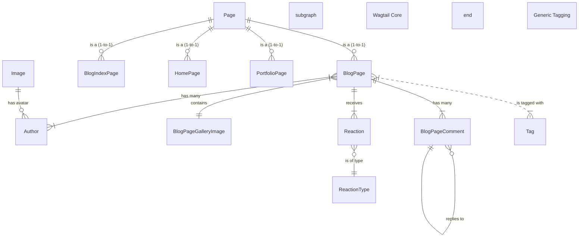

# **博客系统 - 数据库设计说明书**

**版本: 1.0**

**日期: 2025-06-13**

---

## **1. 引言 (Introduction)**

### **1.1 目的 (Purpose)**
本文档旨在为“Wagtail博客系统”提供一个全面、详细的数据库设计方案。它详细描述了系统中使用的关系型数据库（MySQL）和NoSQL数据库（MongoDB）的逻辑和物理设计，包括实体-关系图（ER图）、所有数据表（集合）的结构、字段定义、数据类型、约束和索引策略。

### **1.2 范围 (Scope)**
本文档覆盖了在《软件需求规格说明书 (SRS)》中定义的所有功能所需的数据存储。主要包括：
* **MySQL数据库设计**: 用于存储核心业务数据，如页面、用户、评论、标签等结构化数据。
* **MongoDB数据库设计**: 用于支持高性能的全文检索功能。

---

## **2. 数据库概述 (Database Overview)**

根据系统需求和架构设计，我们采用了混合数据存储方案：
* **主数据库 (Primary Database): MySQL**
    * **作用**: 作为系统唯一的持久化真理之源（Single Source of Truth），存储所有关键的、结构化的业务数据。
    * **理由**: 利用其强大的ACID事务特性、数据一致性和完整性约束（外键等），确保核心业务数据的可靠性。Django ORM 对其有完美的支持。

* **搜索引擎数据存储 (Search Engine Storage): MongoDB**
    * **作用**: 存储为搜索而优化的、反规范化的文本数据。
    * **理由**: MongoDB的文档模型和强大的文本索引能力，结合`jieba`中文分词，可以提供远超MySQL `LIKE`查询的性能和相关性。它专门用于提升搜索功能的用户体验，其数据是根据MySQL中的主数据生成的。

---

## **3. 概念模型 (Conceptual Model)**

下面是系统的核心实体及其关系的简化E-R图，展示了数据之间的主要关联。


* **说明**:
    * `Page`是Wagtail的核心，所有页面类型（`BlogPage`, `HomePage`等）都与它有一对一的关系。
    * 一篇文章 (`BlogPage`) 可以有多个作者 (`Author`)，多个评论 (`BlogPageComment`)，多个图库图片 (`BlogPageGalleryImage`) 和多个标签 (`Tag`)。
    * 一个评论可以回复另一个评论，构成树状结构。

---

## **4. 逻辑设计 - 关系型数据库 (MySQL)**

以下是基于Django模型自动生成的MySQL数据表结构的详细描述。

*(注：仅列出核心表和字段，Django和Wagtail会自动创建一些管理和权限相关的表，此处从略。)*

### **4.1 Wagtail核心表 (由Wagtail框架管理)**

#### **`wagtailcore_page`**
* **描述**: 系统中所有页面的核心基础表，以嵌套集模型存储页面树。
* **字段**:
    | 字段名 | 数据类型 | 约束/说明 |
    | :--- | :--- | :--- |
    | `id` | `INT` | **主键 (PK)**, 自增 |
    | `path` | `VARCHAR(255)` | 树路径，如 `000100020003` |
    | `depth` | `INT` | 在树中的深度 |
    | `numchild` | `INT` | 直接子节点的数量 |
    | `title` | `VARCHAR(255)` | 页面标题 |
    | `slug` | `VARCHAR(255)` | URL中的短标识 |
    | `content_type_id` | `INT` | 外键 (FK) to `django_content_type`，指向具体的页面模型（如`BlogPage`） |
    | `owner_id` | `INT` | 外键 (FK) to `auth_user`，页面所有者 |
    | `live` | `BOOLEAN` | 是否为线上发布状态 |
    | `first_published_at` | `DATETIME` | 首次发布时间 |

#### **`wagtailimages_image`**
* **描述**: 存储所有上传的图片信息。
* **字段**:
    | 字段名 | 数据类型 | 约束/说明 |
    | :--- | :--- | :--- |
    | `id` | `INT` | **主键 (PK)**, 自增 |
    | `title` | `VARCHAR(255)` | 图片标题 |
    | `file` | `VARCHAR(100)` | 文件存储路径 |
    | `width` | `INT` | 图片宽度 |
    | `height` | `INT` | 图片高度 |
    | `created_at` | `DATETIME` | 创建时间 |
    | `uploaded_by_user_id`| `INT` | 外键 (FK) to `auth_user` |

### **4.2 `apps.blog` - 博客应用表**

#### **`blog_blogpage`**
* **描述**: 博客文章页面的具体数据。
* **字段**:
    | 字段名 | 数据类型 | 约束/说明 |
    | :--- | :--- | :--- |
    | `page_ptr_id` | `INT` | **主键 (PK)**, **外键 (FK) to `wagtailcore_page.id` (一对一)** |
    | `date` | `DATE` | 文章发布日期 |
    | `body` | `TEXT` | **StreamField内容**，以JSON格式存储 |

#### **`blog_author`**
* **描述**: 作者信息。
* **字段**:
    | 字段名 | 数据类型 | 约束/说明 |
    | :--- | :--- | :--- |
    | `id` | `INT` | **主键 (PK)**, 自增 |
    | `name` | `VARCHAR(255)` | 作者姓名 |
    | `bio` | `TEXT` | 作者简介 |
    | `author_image_id` | `INT` | 外键 (FK) to `wagtailimages_image.id` (可为空) |

#### **`blog_blogpage_authors`**
* **描述**: 博客文章和作者的多对多关联表。
* **字段**:
    | 字段名 | 数据类型 | 约束/说明 |
    | :--- | :--- | :--- |
    | `id` | `INT` | **主键 (PK)**, 自增 |
    | `blogpage_id` | `INT` | 外键 (FK) to `blog_blogpage.page_ptr_id` |
    | `author_id` | `INT` | 外键 (FK) to `blog_author.id` |

#### **`blog_pageviewcount`**
* **描述**: 记录每篇文章的累计浏览量。
* **字段**:
    | 字段名 | 数据类型 | 约束/说明 |
    | :--- | :--- | :--- |
    | `id` | `INT` | **主键 (PK)**, 自增 |
    | `page_id` | `INT` | **唯一外键 (Unique FK) to `wagtailcore_page.id`** |
    | `total_views` | `INT` | 累计浏览次数 |

### **4.3 `apps.comments` - 评论应用表**

#### **`comments_blogpagecomment`**
* **描述**: 存储博客评论。
* **字段**:
    | 字段名 | 数据类型 | 约束/说明 |
    | :--- | :--- | :--- |
    | `id` | `INT` | **主键 (PK)**, 自增 |
    | `page_id` | `INT` | 外键 (FK) to `wagtailcore_page.id`，评论所属页面 |
    | `parent_id` | `INT` | 外键 (FK) to `self.id` (可为空)，实现评论回复 |
    | `user_name` | `VARCHAR(255)` | 评论者昵称 |
    | `user_email`| `VARCHAR(254)` | 评论者邮箱 |
    | `comment` | `TEXT` | 评论内容 |
    | `submit_date` | `DATETIME` | 提交时间 |
    | `is_approved` | `BOOLEAN` | 是否已批准显示 |
    | `ip_address` | `GenericIPAddressField` | 评论者IP地址 |

### **4.4 `django-taggit` - 标签应用表**

#### **`taggit_tag`**
* **描述**: 存储所有标签。
* **字段**: `id (PK)`, `name (UNIQUE)`, `slug (UNIQUE)`

#### **`taggit_taggeditem`**
* **描述**: 标签和被标记对象的通用关联表。
* **字段**: `id (PK)`, `tag_id (FK)`, `object_id`, `content_type_id` (后两者构成通用外键)

---

## **5. 逻辑设计 - NoSQL数据库 (MongoDB)**

### **5.1 集合 (Collection): `posts`**
* **描述**: 用于全文检索的博客文章数据集合。数据源自MySQL中的`blog_blogpage`，是反规范化的。
* **文档结构示例**:
    ```json
    {
      "_id": " ObjectId('...') ",
      "page_id": 15,
      "title": "如何用Wagtail和Django构建一个博客",
      "content": "这是一篇关于如何使用Wagtail和Django技术栈来快速搭建一个功能强大的个人或团队博客的教程。我们将从项目初始化开始...",
      "publication_date": "ISODate('2025-06-10T00:00:00Z')",
      "author_names": ["张三", "李四"],
      "tag_names": ["Django", "Wagtail", "Python"],
      "tokens": [ "如何", "用", "wagtail", "和", "django", "构建", "一个", "博客", "..." ]
    }
    ```
* **字段说明**:
    * `page_id`: 对应 `wagtailcore_page.id`，用于从搜索结果链接回原始页面。
    * `title`, `content`, `author_names`, `tag_names`: 从MySQL中冗余过来的字段，用于显示在搜索结果或作为搜索权重的一部分。
    * `tokens`: **核心字段**。由`title`和`content`合并后，使用`jieba`进行中文分词，并转换为小写后得到的结果。搜索引擎将主要在此字段上工作。

### **5.2 索引策略**
* **`page_id`**: 建立**唯一索引**，确保数据不重复，并可快速反查。
* **`tokens`**: 建立**文本索引 (Text Index)**，这是实现高效全文检索的关键。
* **`publication_date`**: 建立普通索引，用于按日期对搜索结果进行排序。

---

## **6. 物理设计与优化策略**

* **MySQL存储引擎**: 默认使用`InnoDB`，它支持事务和行级锁，非常适合高并发的Web应用。
* **索引**:
    * 所有外键（`ForeignKey`）字段都应自动创建索引。
    * 在`wagtailcore_page`的`path`字段上创建索引，以加速页面树的遍历查询。
    * 在经常用于`filter`和`order_by`的字段上（如`blog_blogpage.date`, `comments_blogpagecomment.submit_date`）创建索引。
* **数据完整性**: 严格依赖MySQL的外键约束来保证实体间的引用完整性。例如，删除一个`BlogPage`时，与其关联的评论也应被级联删除（或设置为NULL，取决于模型定义）。
* **数据库连接池**: 在生产环境中，应使用如`Dj-database-url`配合连接池工具（如PGBouncer，即使是用于MySQL）来管理数据库连接，减少连接/断开的开销。
