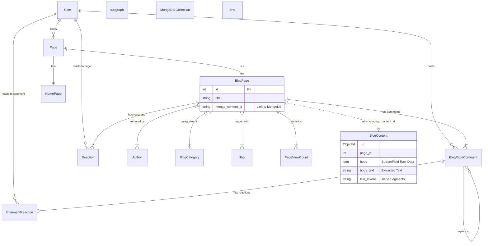

# **博客系统 - 数据库设计说明书 (DDS)**

## **1. 引言 (Introduction)**

### **1.1 目的 (Purpose)**
本文档为“Wagtail博客系统”提供详细的数据库设计方案。基于“关系型 + 文档型”的混合存储架构，详细定义 MySQL 和 MongoDB 的逻辑结构、物理设计及索引策略，以确保数据的一致性、完整性及系统的高性能。

### **1.2 范围 (Scope)**
本文档覆盖后端所有持久化存储需求，主要包括：
* **MySQL (Metadata Store)**: 存储页面层级、用户权限、评论互动、分类标签等结构化元数据。
* **MongoDB (Content Store & Search)**: 存储博客文章的富文本正文（StreamField JSON）、分词后的搜索索引数据。

## **2. 数据库架构策略 (Database Strategy)**

系统采用 **混合持久化 (Polyglot Persistence)** 策略：

| 特性         | MySQL (主库)                                              | MongoDB (内容库)                                           |
| :----------- | :-------------------------------------------------------- | :--------------------------------------------------------- |
| **角色**     | **元数据与关系中心**                                      | **非结构化内容与搜索中心**                                 |
| **存储内容** | `Page` 树结构, 用户, 评论, 标签, 反应, `mongo_content_id` | 博客文章正文 (`StreamField` JSON), 纯文本提取, 分词 Tokens |
| **读写模式** | 高频读取元数据，事务性写入                                | 读时合并 (Read-Merge)，写时同步 (Write-Sync)               |
| **一致性**   | ACID 强一致性                                             | 最终一致性 (由应用层逻辑保证)                              |

## **3. 概念模型 (Conceptual Model)**



## **4. 逻辑设计 - 关系型数据库 (MySQL)**

### **4.1 博客核心表 (`apps.blog`)**

#### **`blog_blogpage`**

  * **描述**: 博客文章的元数据表。正文内容被剥离至 MongoDB。
  * **字段**:
    | 字段名 | 类型 | 约束/说明 |
    | :--- | :--- | :--- |
    | `page_ptr_id` | `INT` | **PK, FK** -\> `wagtailcore_page.id` |
    | `date` | `DATE` | 发布日期，用于排序和归档 |
    | `intro` | `TEXT` | 文章简介（富文本 JSON） |
    | `mongo_content_id` | `VARCHAR(50)` | **关键字段**，存储 MongoDB 中对应文档的 `_id` 字符串 |
    | `featured_image_id`| `INT` | FK -\> `blog_blogimage` |

#### **`blog_author`**

  * **描述**: 作者信息实体。
  * **字段**: `id`, `name`, `bio` (StreamField JSON), `author_image_id` (FK)。

#### **`blog_reactiontype`**

  * **描述**: 定义反应类型（如：点赞、爱心、思考）。
  * **字段**: `id`, `name` (显示名称), `icon` (CSS图标类), `display_order`。

#### **`blog_reaction`**

  * **描述**: 用户对文章的反应记录。
  * **字段**:
    | 字段名 | 类型 | 约束/说明 |
    | :--- | :--- | :--- |
    | `id` | `INT` | PK |
    | `page_id` | `INT` | FK -\> `wagtailcore_page` |
    | `user_id` | `INT` | FK -\> `auth_user` (可为空) |
    | `reaction_type_id` | `INT` | FK -\> `blog_reactiontype` |
    | `session_key` | `VARCHAR` | 匿名用户标识 |
    | `ip_address` | `GenericIPAddress` | 防止刷赞 |

#### **`blog_pageviewcount`**

  * **描述**: 文章每日浏览量统计聚合表。
  * **字段**: `id`, `page_id`, `date`, `count` (总PV), `unique_count` (UV)。

### **4.2 评论系统表 (`apps.comments`)**

#### **`comments_blogpagecomment`**

  * **描述**: 自定义的评论存储表，支持嵌套回复。
  * **字段**:
    | 字段名 | 类型 | 约束/说明 |
    | :--- | :--- | :--- |
    | `id` | `INT` | PK |
    | `page_id` | `INT` | FK -\> `blog_blogpage` |
    | `parent_id` | `INT` | FK -\> `self` (自关联，实现楼中楼) |
    | `author_user_id` | `INT` | FK -\> `auth_user` |
    | `content` | `TEXT` | 评论纯文本内容 |
    | `status` | `VARCHAR` | 'approved' / 'pending' / 'deleted' |
    | `like_count` | `INT` | 点赞计数缓存 |
    | `reply_count` | `INT` | 子回复计数缓存 |
    | `ip_address` | `GenericIPAddress` | 来源IP |
    | `can_edit_until` | `DATETIME` | 可编辑截止时间 |

#### **`comments_commentreaction`**

  * **描述**: 针对评论的点赞/点踩记录。
  * **字段**: `id`, `comment_id`, `user_id`, `reaction_type` (1=赞, -1=踩)。

### **4.3 基础应用表 (`apps.base`)**

#### **`base_formpage`**

  * **描述**: 自定义表单页面（如联系我们）。
  * **字段**: `intro`, `thank_you_text`, `to_address`, `send_confirmation_email` 等配置项。

## **5. 逻辑设计 - NoSQL数据库 (MongoDB)**

### **5.1 集合: `blog_content`**

  * **描述**: 存储博客文章的完整内容结构和搜索索引数据。

  * **数据来源**: 由 `BlogPage.save()` 方法将 StreamField 数据转换后写入。

  * **文档结构 (JSON Schema)**:

    ```json
    {
      "_id": ObjectId("..."),
      "page_id": 1024,             // 关联 MySQL wagtailcore_page.id
      "title": "Wagtail 教程",
      "intro": "...",              // 简介文本
      "updated_at": "2025-06-14T10:00:00",
      
      // 1. 原始内容 (用于渲染)
      "body": [
        { "type": "rich_text", "value": "<p>...</p>", "id": "..." },
        { "type": "code_block", "value": { "language": "python", "code": "..." } },
        { "type": "mermaid_block", "value": "graph TD..." }
      ],
      
      // 2. 提取文本 (用于搜索显示)
      "body_text": "Wagtail 教程 ... graph TD ...",
      
      // 3. 搜索索引 (Jieba 分词结果)
      "title_tokens": "Wagtail 教程 Django",
      "intro_tokens": "简介 文本 ...",
      "full_text_search_index": "..." // 隐式文本索引字段
    }
    ```

### **5.2 索引策略 (Indexes)**

根据 `mongo.py` 的实现：

1.  **唯一索引**:

      * `{"page_id": 1}` (Unique): 确保每个 MySQL 页面在 MongoDB 中只有一份内容文档。

2.  **全文复合索引 (Text Index)**:

      * **字段**:
          * `title_tokens`: 权重 (Weight) 10
          * `intro_tokens`: 权重 5
          * `body_text`: 权重 1
      * **属性**: `default_language="none"` (使用预分词数据)。
      * **用途**: 支持 `mongo.py` 中的 `search_blog_content` 方法进行加权全文检索。

## **6. 物理设计与性能优化**

### **6.1 MySQL 优化**

  * **索引**:
      * `blog_blogpage(date)`: 优化按日期归档查询。
      * `comments_blogpagecomment(page_id, status)`: 优化评论列表加载。
      * `blog_reaction(page_id, user_id)`: 优化用户反应状态检查。
  * **事务**:
      * 文章发布过程涉及 MySQL 元数据更新和 MongoDB 内容写入，虽然无法跨库事务，但代码逻辑确保了\*\*“先写 Mongo 获 ID，再写 MySQL”\*\*的顺序，最大程度保证数据关联性。

### **6.2 MongoDB 优化**

  * **连接池**: `MongoManager` 使用单例模式维护 `MongoClient`，配置 `serverSelectionTimeoutMS=5000` 防止连接阻塞。
  * **搜索降级**: 当分词搜索无结果时，系统会自动回退到基于正则表达式 (`$regex`) 的模糊匹配，确保长尾词召回率。

### **6.3 缓存策略 (Redis)**

  * **Page Views**: 页面浏览量首先在 Redis 中计数 (`page_views:{id}`)，通过定时任务 (`sync_pageviews`) 批量同步回 MySQL，减轻数据库写压力。
  * **评论频率限制**: 使用 Redis 缓存记录用户 IP 的评论时间戳，防止垃圾评论轰炸。
